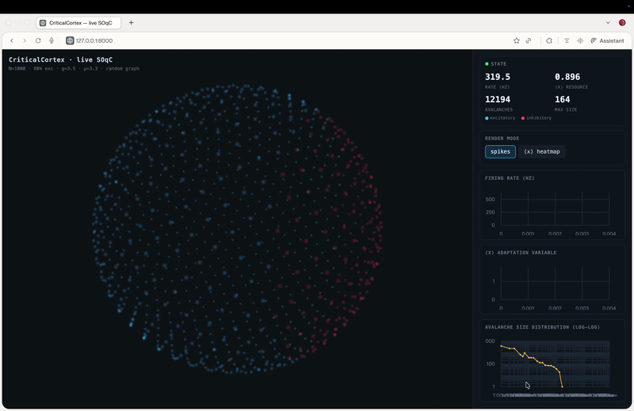

# Real-Time Spiking Neural Network Simulation

[](https://www.rust-lang.org/)
[](https://fastapi.tiangolo.com/)
[](https://threejs.org/)

An interactive, high-performance 3D simulation of an E/I-balanced Izhikevich neural network, designed to study **Self-Organized Quasi-Criticality (SOqC)** in real-time. 

This project features a hybrid architecture: a blistering-fast **Rust core** for heavy mathematical simulation, connected via a **FastAPI WebSocket bridge** to a lightweight **WebGL (Three.js) frontend** running in the browser.

---

## 🚀 Live Demo & Preview


*Watch the WebGL neuron cloud transition from discrete spike rendering to a continuous intensity heatmap under heavy computational load.*

---

## 🧠 Scientific Context: From SOC to Quasi-Criticality

This project was built to empirically test the hypothesis of **Self-Organized Criticality (SOC)** in neural networks—often referred to as the "critical brain hypothesis." 

In statistical physics, a system is critical when it balances on the edge of a phase transition, characterized by neural avalanches following a power-law distribution:

$$P(S) \propto S^{-\tau}$$

Where the theoretical exponent for directed percolation/critical branching processes is $\tau \approx 1.5$.

### The Discovery: Self-Organized Quasi-Criticality (SOqC)
While aiming to reproduce textbook SOC, rigorous statistical validation within this system repeatedly rejected the strict power-law hypothesis due to finite-size constraints and dissipation. Instead, the network naturally settled into **Self-Organized Quasi-Criticality (SOqC)**.

| Phenomenon | Verification Status | Observed Exponent ($\tau_{size}$) | Verdict |
| :--- | :---: | :---: | :--- |
| **Strict SOC** | `FAIL` | N/A | Rejected due to finite-size cutoff |
| **Quasi-Criticality (SOqC)** | `PASS` | ~2.15 (with $\sigma_{MR} \approx 0.98$) | Confirmed |

---

## ⚙️ Configuration (Environment Variables)

You can customize the simulation behavior at launch using environment variables. The defaults represent the validated SOqC operating point:

| Variable | Default | Description |
| :--- | :---: | :--- |
| `M5_N` | `1000` | Neuron count (can be scaled up to `2000`+). |
| `M5_G` | `3.5` | Control parameter (global synaptic coupling strength). |
| `M5_MU_EXT` | `3.3` | Tonic external input (background drive). |
| `M5_EI_RATIO` | `0.8` | Excitatory fraction (ratio for balanced E/I dynamics). |
| `M5_TAU_HOMEO` | `50000` | Homeostatic plastic adaptation time constant (in ms). |
| `M5_STEPS_PER_FRAME` | `20` | Simulation steps advanced per broadcast frame (live-adjustable via slider). |
| `M5_FPS` | `30` | Broadcast cap (max update frequency sent to clients over WebSockets). |
| `M5_SPATIAL` | `1` | Distance-embedded connectome (Fibonacci sphere). `1` = wave propagation, `0` = random graph. |
| `M5_LOCALITY` | `0.35` | Exponential length-scale of connectivity. Lower values tighten the spatial propagation. |
| `M5_DIST_DELAYS` | `1` | Axonal conduction delays proportional to spatial distance (`1` = enabled, `0` = instant). |

**Example launch command with custom parameters:**
```bash
M5_N=2000 M5_STEPS_PER_FRAME=40 M5_LOCALITY=0.25 python3 server.py
New project - Claude/
├── criticalcortex/            # existing package (Rust kernel, sim, criticality, avalanche_stats)
└── m5_viz/                     # this milestone
    ├── server.py               # FastAPI + WebSocket backend; paced 30 FPS broadcaster
    ├── sim_engine.py           # backend-agnostic streaming stepper (Rust kernel or NumPy reference)
    ├── protocol.py             # binary render-frame wire format (single source of truth)
    ├── requirements.txt
    ├── README.md
    └── static/
        ├── index.html          # UI shell (Three.js + uPlot from CDN)
        └── app.js              # WS client, neuron cloud, live charts
New project - Claude/
├── criticalcortex/            # existing package (Rust kernel, sim, criticality, avalanche_stats)
└── m5_viz/                     # this milestone
    ├── server.py               # FastAPI + WebSocket backend; paced 30 FPS broadcaster
    ├── sim_engine.py           # backend-agnostic streaming stepper (Rust kernel or NumPy reference)
    ├── protocol.py             # binary render-frame wire format (single source of truth)
    ├── requirements.txt
    ├── README.md
    └── static/
        ├── index.html          # UI shell (Three.js + uPlot from CDN)
        └── app.js              # WS client, neuron cloud, live charts
### 🧱 System Architecture


🧱 Architecture Details
•	Decoupled ticks: One shared SimEngine advances STEPS_PER_FRAME steps per frame; a single paced broadcaster() task emits one render frame per client at ‭$\le$‬ FPS. Many simulation ticks map to one render tick, so the kernel is never throttled by the browser. Stepping runs in a worker thread (asyncio.to_thread) so the event loop stays responsive.
•	Bounded memory: The AER sink is reset every batch (aer_count[0] ‭$\leftarrow$‬ 0), so an indefinite live run reuses a fixed buffer — nothing grows without bound, and the zero-allocation kernel hot loop is untouched.
•	Wire format: Hot path is a compact little-endian binary frame (see protocol.py): header (frame id, abs step, rate, ‭$\langle x \rangle$‬‭‬‭‬, N, n_glow) + uint16 spike ids. Control/analytics go as JSON on the same socket. The browser distinguishes by typeof event.data.
•	Controls: The playback slider and pause button send {cmd:…} JSON back over the socket.
🌍 Spatial Mode (default)
M5_SPATIAL=1 (default) uses criticalcortex.spatial_connectome: neurons are embedded on the Fibonacci sphere and each still draws EXACTLY K inputs with the exact E/I split, but partners are sampled with probability ‭$\propto \exp(-\text{distance}/\text{locality})$‬‭‬‭‬‭‬‭‬ (Gumbel-top-k), inhibition is interspersed (not clumped at a pole), and delays scale with distance.
SOqC is preserved under embedding (measured, reference backend, N=1000): ‭$\sigma_{MR}$‬ self-organizes to ‭$\approx 0.97$‬ for BOTH the spatial and random connectomes.
⚠️ Notes / honest caveats
•	Near-critical avalanches are fractal, not clean expanding rings — with locality you see spatially-contiguous local cascades (a real improvement over global flicker), but not textbook circular wavefronts every time. Lower M5_LOCALITY makes propagation more wave-like.
•	Tested here: spatial connectome (fixed in-degree, exact E/I split, interspersed inhibition, edge locality, distance–delay correlation 0.997), sim_engine stepping in spatial mode, the rolling histogram, the binary encode/decode roundtrip, and app.js/server.py syntax — all against the NumPy reference.
•	Note: The full FastAPI server can't run in the build sandbox (no network to install FastAPI); first real end-to-end run is on the Mac.
